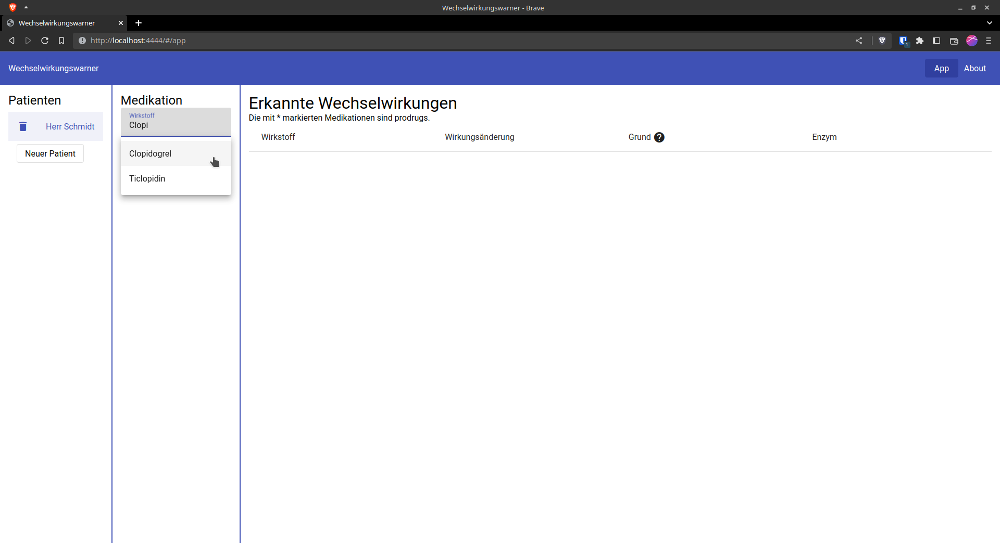
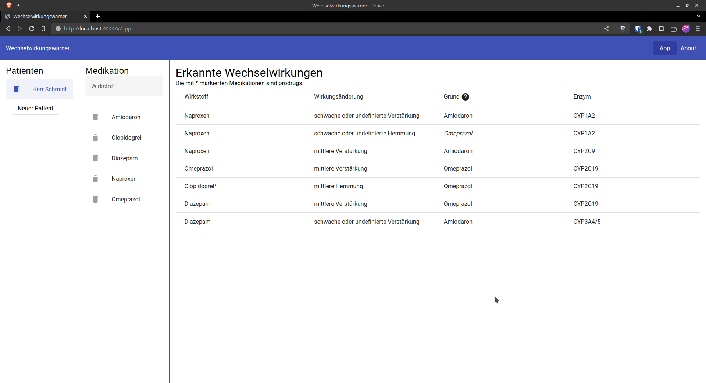

# MedInfWiss2 Wechselwirkungswarner

Diese App wurde im Rahmen der Vorlesung MedInfWiss2 des [Lehrstuhls für Medizinische Informatik der FAU](https://www.imi.med.fau.de/) erstellt.

Ziel ist es, einen Automatismus zur Generierung von Warnhinweisen zu erstellen. Die Daten beziehen sich auf den Artikel [Arzneimittelinteraktionen - Prinzipien, Beispiele und klinische Folgen](https://www.aerzteblatt.de/archiv/128411/Arzneimittelinteraktionen) des Ärzteblatts.

## Demo

You can find a demo here: https://joluj.github.io/medinfwiss2/.

## Development

1. Install required tools: [NodeJS](https://nodejs.org/en/) and [Yarn](https://classic.yarnpkg.com/en/docs/install) (`npm install --global yarn`)
2. Install development dependencies `yarn install`
3. Run `yarn nx serve app`
4. Open your app on `http://localhost:4444/`

## Showcase

### 1. Patienten hinzufügen

### 2. Medikation hinzufügen

Hier werden alle Wirkstoffe aus Tabelle 3 und 4 angezeigt.

### 3. Wechselwirkungen einsehen

Hier können alle Wechselwirkungen der Medikation eingesehen werden.

Angezeigt wird, welcher Wirkstoff (Spalte *Wirkstoff*) in der Wirkung verändert wird (Spalte *Wirkungsänderung*). Die Änderung wird durch eine Hemmung oder Verstärkung am Enzym (Spalte *Enzym*) des Wirkstoffes aus der Spalte *Grund* hervorgerufen.

Wirkstoffe, die Produgs sind, werden mit Sternchen ("*") markiert (hier: Clopidogrel).

In der Spalte *Grund* werden Induktoren kursiv geschrieben, Inhibitoren normal.

